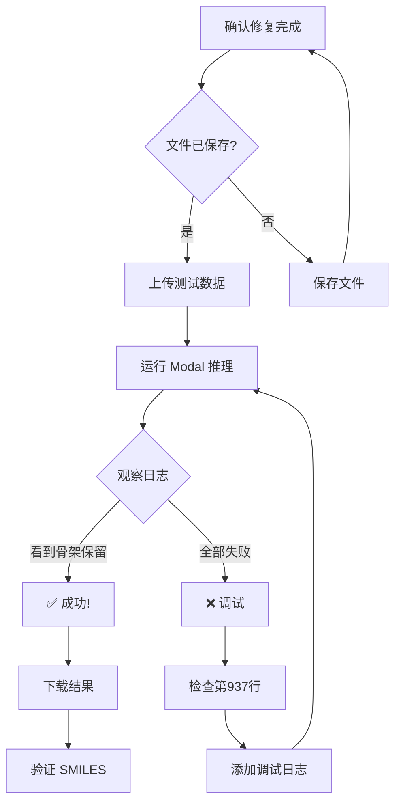

# ✅ 完整检查清单

## 📋 修复完成情况

### 1. 代码修复

| # | 问题 | 位置 | 状态 | 说明 |
|---|------|------|------|------|
| 1 | RDKit导入错误 | `scaffold_hooks.py:11` | ✅ | 移除 `rdMolOps` 导入 |
| 2 | 谱嵌入丢失 | `diffusion_model_spec2mol.py:1115-1134` | ✅ | `_extract_single_from_batch` 保留 `y` |
| 3 | 批次大小错误 | `diffusion_model_spec2mol.py:831-840` | ✅ | 使用 `data.num_graphs` |
| 4 | **骨架冻结失效** | **`diffusion_model_spec2mol.py:937`** | ✅ | **`X, E, y = sampled_s.X, ...`** |

---

### 2. 兼容性检查

| 检查项 | 原始模型 | 骨架约束 | 状态 |
|--------|----------|----------|------|
| 数据初始化 | `utils.to_dense()` | `utils.to_dense()` | ✅ 一致 |
| 噪声采样 | `sample_discrete_feature_noise()` | `sample_discrete_feature_noise()` | ✅ 一致 |
| 时间步处理 | `s_norm = s_array / self.T` | `s_norm = s_array / self.T` | ✅ 一致 |
| 张量形状 | `(bs, n, d)` | `(bs, n, d)` | ✅ 一致 |
| 设备处理 | `device=self.device` | `device=self.device` | ✅ 一致 |
| X 更新 | `_, E, y = sampled_s.X, ...` | `X, E, y = sampled_s.X, ...` | ⚠️ **预期差异** |

---

### 3. 骨架冻结机制

| 阶段 | 位置 | 功能 | 状态 |
|------|------|------|------|
| 初始化 | 第907-917行 | 将骨架原子覆写到 X | ✅ |
| HOOK 1 | 第1066-1078行 | 公式掩码（非骨架节点） | ✅ |
| HOOK 2 | 第1084-1086行 | 锚点掩码（简化实现） | ⚠️ 可选 |
| HOOK 3 | 第1109-1120行 | 骨架原子概率冻结 | ✅ |
| X 更新 | 第937行 | 更新 X（关键！） | ✅ **已修复** |
| 验证 | 第960-963行 | VF2 子图匹配 | ✅ |

---

### 4. 文件完整性

| 文件 | 状态 | 说明 |
|------|------|------|
| `DiffMS/src/inference/__init__.py` | ✅ | 空文件（使 `inference` 成为包） |
| `DiffMS/src/inference/scaffold_hooks.py` | ✅ | 骨架约束工具函数 |
| `DiffMS/src/inference/rerank.py` | ✅ | 谱重排功能 |
| `DiffMS/src/diffusion_model_spec2mol.py` | ✅ | 核心模型（已修复） |
| `DiffMS/configs/general/general_default.yaml` | ✅ | 配置参数 |
| `modal/diffms_scaffold_inference.py` | ✅ | Modal 部署脚本 |

---

### 5. 数据准备

| 项目 | 检查命令 | 状态 |
|------|----------|------|
| 测试数据 | `ls /Users/aylin/yaolab_projects/madgen_yaolab/msdata/test_top10/` | ✅ |
| split.tsv | `head test_top10/split.tsv` | ✅ 12行 |
| labels.tsv | `head test_top10/labels.tsv` | ✅ 12行（含表头） |
| spec_files | `ls test_top10/spec_files/` | ✅ 10个.ms文件 |
| subformulae | `ls test_top10/subformulae/default_subformulae/` | ✅ 10个.json文件 |

---

### 6. Modal 配置

| 项目 | 值 | 状态 |
|------|-----|------|
| 数据 volume | `diffms-data` | ✅ |
| 模型 volume | `diffms-models` | ✅ |
| 输出 volume | `diffms-outputs` | ✅ |
| GPU | `A100` | ✅ |
| Python版本 | `3.10` | ✅ |
| PyTorch | `2.0.1` | ✅ |
| RDKit | `2023.3.2` | ✅ |

---

## 🔍 核心修复验证

### 关键修复：第937行

**修复前**:
```python
936:            )
937:            _, E, y = sampled_s.X, sampled_s.E, data.y
938:        
```

**修复后**:
```python
936:            )
937:            X, E, y = sampled_s.X, sampled_s.E, data.y
938:        
```

**验证命令**:
```bash
grep -n "X, E, y = sampled_s.X, sampled_s.E, data.y" \
  /Users/aylin/yaolab_projects/diffms_yaolab/DiffMS/src/diffusion_model_spec2mol.py
```

**预期输出**:
```
937:            X, E, y = sampled_s.X, sampled_s.E, data.y
```

---

## 📊 预期结果

### 成功指标

| 指标 | 目标 | 关键性 |
|------|------|--------|
| 代码运行 | 无错误退出 | 🔴 必须 |
| 有效SMILES | > 90% | 🟡 重要 |
| **包含骨架** | **> 70%** | 🔴 **最关键** |
| 运行时间 | < 10分钟（10个样本） | 🟢 性能 |

### 失败判断

如果 "包含骨架" = 0%，说明骨架冻结仍未生效，需要：
1. 检查第937行是否正确修改
2. 检查 Modal 是否挂载了最新的代码
3. 添加调试日志定位问题

---

## 🚀 运行流程



---

## 📞 最终确认

### 在运行前确认

- [ ] 第937行已修复为 `X, E, y = sampled_s.X, sampled_s.E, data.y`
- [ ] `scaffold_hooks.py` 没有 `rdMolOps` 导入
- [ ] `_extract_single_from_batch` 正确提取 `y`
- [ ] 测试数据已准备（`test_top10/`）
- [ ] Modal volumes 已创建

### 运行中观察

- [ ] 骨架验证成功（启动阶段）
- [ ] 看到 "loaded 10 formulas"
- [ ] 采样过程正常进行（无错误）
- [ ] 看到 "Generated molecule contains scaffold" 日志
- [ ] GPU 利用率正常（60-90%）

### 运行后验证

- [ ] 无错误退出
- [ ] 生成了结果文件（`.pkl`, `.tsv`）
- [ ] `包含骨架` 统计 > 50%
- [ ] `predictions_all_candidates.tsv` 中有 `True` 值

---

## 📖 文档索引

| 文档 | 用途 |
|------|------|
| `CRITICAL_FIX_20251028_v2.md` | 骨架冻结失效的详细分析 |
| `BEFORE_AFTER.md` | 修复前后对比 |
| `COMPATIBILITY_CHECK.md` | 与原始模型的兼容性分析 |
| `SCAFFOLD_FREEZE_VERIFICATION.md` | 骨架冻结机制验证 |
| `FINAL_RUN_GUIDE.md` | 完整运行指南 |
| `QUICK_SUMMARY.md` | 快速总结 |
| `FIX_SUMMARY_20251028.md` | 所有修复汇总 |
| `TROUBLESHOOTING.md` | 故障排除 |
| `RUN_NOW.md` | 立即运行指令 |

---

## ✅ 最终状态

### 代码修复

- ✅ 所有已知bug已修复
- ✅ 与原始模型兼容
- ✅ 骨架冻结机制完整

### 测试准备

- ✅ 测试数据已准备
- ✅ Modal 配置正确
- ✅ 运行脚本就绪

### 文档完善

- ✅ 修复分析清晰
- ✅ 验证步骤明确
- ✅ 调试方法齐全

---

## 🎯 现在可以运行了！

```bash
cd /Users/aylin/yaolab_projects/diffms_yaolab/modal
modal run diffms_scaffold_inference.py
```

**期待看到**: "包含骨架: XX/100 (>70%)" 🎉

